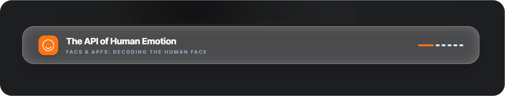

<p align="center">
  <picture>
    <source srcset="./public/banner_dark.png" media="(prefers-color-scheme: dark)">
    <source srcset="./public/banner_light.png" media="(prefers-color-scheme: light)">
    
  </picture>

  <h2 align="center"> FACS & APFS 3D Simulator </h2>
  <p align="center"> The API of Human Emotion. A real-time, browser-based facial tracking and 3D rendering engine.</p>
</p>

<div align="center">

  [](https://opensource.org/licenses/MIT) [](https://github.com/sponsors/addispupi) [](https://github.com/addispupi/weshet-filler/stargazers)


  [](https://nextjs.org/) [](https://react.dev/) [](https://www.typescriptlang.org/) [](https://tailwindcss.com/) [](https://threejs.org/) [](https://developers.google.com/mediapipe) [](https://pnpm.io/) 

</div>
This project translates raw webcam feeds into precise **Facial Action Coding System (FACS)** data and maps it to 3D geometry using the principles of **Anatomically Plausible Facial Systems (APFS)**.

It began as an `AI-Powered` **[Education Learning](siltawi.com)** platform and is evolving toward interactive entertainment workflows and pipeline-oriented decision-making tooling.

## Table of contents

- [Overview](#overview)
- [Current capabilities](#current-capabilities)
- [System requirements](#system-requirements)
- [Architecture](#architecture)
- [Technology stack](#technology-stack)
- [Getting started](#getting-started)
- [Package management](#package-management)
- [Product roadmap](#product-roadmap)
- [Contributing](#contributing)

## Overview

The pipeline runs entirely in the client: video frames are processed by MediaPipe’s **Face Landmarker** (WASM, GPU-backed), which emits a vector of face **blendshape categories** (typically up to **52** ARKit-style names). Application state holds these weights; a subset is shown in the live panel, and derived scores drive a placeholder **3D** visualization (wireframe sphere) with optional manual overrides.

## Current capabilities

- **Client-side inference:** `@mediapipe/tasks-vision` `FaceLandmarker` with `outputFaceBlendshapes` enabled, GPU delegate, and WASM loaded from the official CDN; no server round-trip for inference.
- **Blendshape data:** The model supplies the full blendshape vector; the on-screen **live console** lists a **fixed subset** of categories (e.g. smile left/right, brow and blink) for readability, not all 52 names at once.
- **3D mapping:** **React Three Fiber** + **Three.js** render a **wireframe sphere** whose motion and deformation are driven by mapped channels (e.g. averaged smile, `browInnerUp`, `jawOpen`), with **sliders** and **reset** to override live values for testing.
- **Stack layout:** Next.js **App Router** with source under [`src/`](src/) and path alias `@/*` → `./src/*` (see [`tsconfig.json`](tsconfig.json)).

## System requirements

- A **modern browser** with **WebGL** (for the 3D view).
- **Camera** access; **HTTPS** or **localhost** is required for `getUserMedia` in typical deployments.
- Sufficient performance for real-time face landmarking (GPU delegate is requested where supported).

## Architecture


## Technology stack

| Layer | Packages / versions |
|--------|---------------------|
| Framework | Next.js **16.2.1** (App Router), React **19.2.4** |
| Language | TypeScript **5** |
| Styling | Tailwind CSS **4** (`@tailwindcss/postcss`) |
| 3D | `three` **^0.183.2**, `@react-three/fiber` **^9.5.0**, `@react-three/drei` **^10.7.7** |
| Vision | `@mediapipe/tasks-vision` **^0.10.34** |
| Lint | ESLint **9**, `eslint-config-next` **16.2.1** |
| Package manager | **pnpm** **10.28** ([`package.json`](package.json) `packageManager` for Corepack); lockfile [`pnpm-lock.yaml`](pnpm-lock.yaml) |

## Getting started

### Prerequisites

- **Node.js:** (current LTS or newer).
- **pnpm:** enable via [Corepack](https://nodejs.org/api/corepack.html) (ships with Node.js):

  ```bash
  corepack enable
  corepack prepare pnpm@10.28.0 --activate
  ```

  This matches the `packageManager` field so installs behave the same in CI and locally.

  Alternatively, install pnpm [globally](https://pnpm.io/installation) using your preferred method.

### Clone and install

```bash
git clone https://github.com/addispupi/facs-apfs-3d-simulator.git
cd facs-apfs-3d-simulator
pnpm install
```

### Development

```bash
pnpm dev
```

Open [http://localhost:3000](http://localhost:3000) and grant **camera** permission when prompted.

### Production build

```bash
pnpm build
pnpm start
```

### Lint

```bash
pnpm lint
```

## Package management

The repo uses **pnpm** only: **`pnpm-lock.yaml`** is the source of truth for dependency versions (commit it). **`package-lock.json`** is listed in [`.gitignore`](.gitignore) so accidental `npm install` output is not committed.

Use `pnpm <script>` for npm scripts (for example, `pnpm dev`, `pnpm build`). In CI, run `pnpm install --frozen-lockfile` (or rely on the default when `CI=true`) after checking out the lockfile.

## Product roadmap

<details>
<summary><strong>Phase 1: Emotion trainer (calibration and baselines)</strong></summary>

Before emotion-related analytics can be personalized, the system should learn an individual baseline.

- **Baseline calibration:** A guided flow that prompts users for specific expressions (for example, neutral, smile, frustration) and persists the associated blendshape footprints (for example, to a database).
- **Expression snapshots:** Capture the current blendshape array as a reusable JSON preset.

</details>

<details>
<summary><strong>Phase 2: Authenticity and engagement signals</strong></summary>

Move from descriptive weights toward rule-based or model-based classification.

- **Duchenne smile analysis:** Compare mouth-related movement (for example, AU12) with periocular tightening (for example, AU6) to support genuine versus posed smile hypotheses.
- **Confidence scoring:** Compare live input to Phase 1 baselines to produce interpretable scores.
- **Event layer:** Emit structured events (for example, frustration, engagement) for other UI modules to consume.

</details>

<details>
<summary><strong>Phase 3: VFX and pipeline integration</strong></summary>

Bridge browser capture with offline and engine workflows.

- **Session recording:** Record performance segments and export animation-friendly tracks (for example, JSON or BVH).
- **Advanced rig mapping:** Drive richer rigs beyond the current placeholder sphere—skin sliding, volume preservation, and collision-aware setups where applicable.
- **Viseme-oriented extraction:** Isolate mouth shapes for speech and lip-sync, including locale-specific phoneme tuning where required.

</details>

## Contributing

Contributions are welcome. Please open an issue to discuss larger changes before substantial pull requests.

1. Fork the repository and create a branch from the default branch.
2. Keep changes focused; match existing code style and conventions.
3. Run `pnpm lint` before submitting.
4. Describe the motivation and testing performed in the pull request.

Examples of useful contributions include extending **blendshape-to-rig mapping**, improving **accessibility** or **performance**, adding **tests**, or replacing the **placeholder sphere** with a rigged character mesh appropriate to your license and asset pipeline.

---
<div align="center">
Made with ❤️ for the community.
</div>
